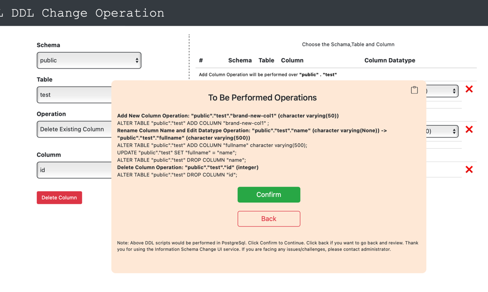
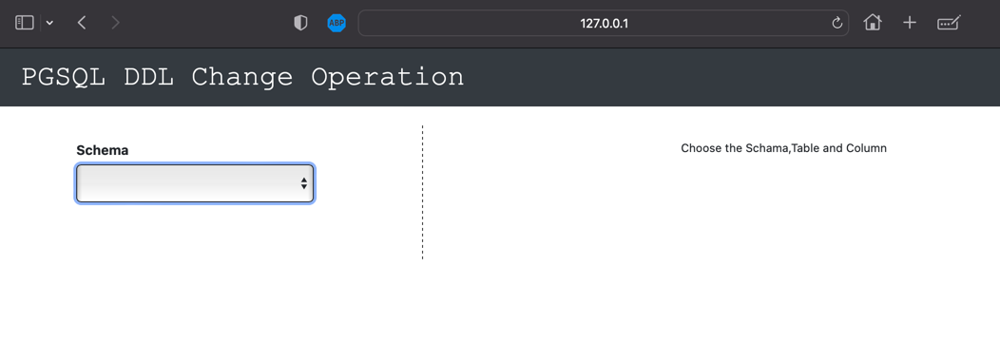

FLASK DDL CHANGE OPERATION
---

```Author: TUHIN MAJUMDER```<br>
```Last Update: Aug 2023```

---

<h5> Welcome to my Flask DDL Change Operation Repository. 
This is so unique yet helpful for any project to touch the database without changing the database by the Admin Team.</h5>


___

###  Few Features on this Project:

- [x] Use Flasks so totally opensource
- [x] Either ```Redshift``` or ```PostgreSQL``` or ```MSSQL``` or any DB, it can handle every db on its own
- [x] No ```Jquery``` (Only ```HTML``` and``` JavaScript``` andd ```Python```), so less dependency
- [x] BasicAuth implemented for a bare minimum security
- [x] A lightning fast and so interactive with no compromise on User Experience
- [x] Ready to handle billions of request

---
### Steps to Implement on your Local

1. Install and Connect DB
   1. If you're using PostgreSQL, install PostGreSQL and PGAdmin(Optional) and Collect the credentials
   2. If you're planning to use MsSQL, install SQL Server and Workbench (Optional) and collect the credentials
2. Assuming you've already installed ```Python``` on your machine, open the any IDE (read Pycharm Community Edition), and in its terminal run 
   ```python
   pip install -r requirements.txt
   ```
3. Change the Database credentials that you've already retrieved in ```rft_to_ui.py``` file and basic auth credentials in ```server.py```
4. now Deploy the app to your local with this command in your terminal
   ```python
   python server.py
   ```
5. You will see your app is running on [http://localhost:8000/operation](http://localhost:8000/operation)

   

---